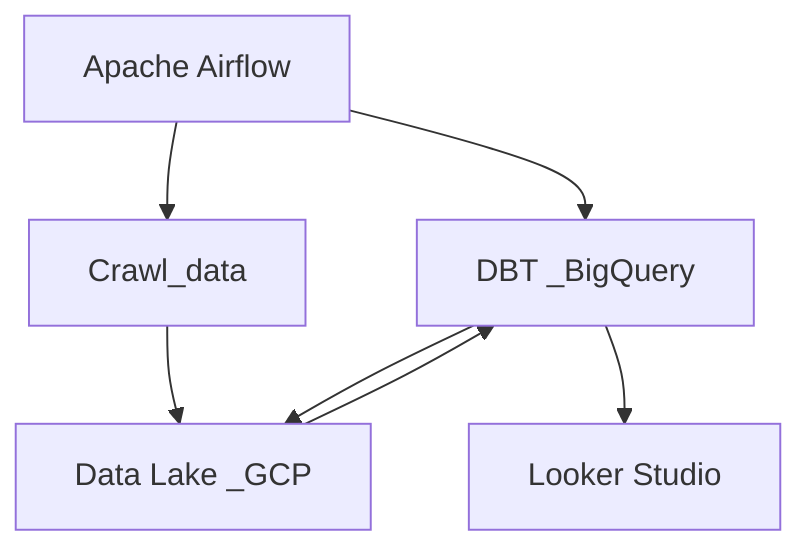

# bds-dbt-bq-looker

## Mực lục 
- [Tổng quan](#tổng-quan)
- [Yêu cầu](#yêu-cầu)
- [Cài đặt](#cài-đặt)
- [Cấu hình](#cấu-hình)
- [Sử dụng](#sử-dụng)
- [luồng dữ liệu](#luồng-dữ-liệu)
- [Cấu trúc dự án](#cấu-trúc-dự-án)
- [Hình ảnh](#hình-ảnh)

## Tổng quan
***Dự án này mục đích xây dựng pipeline để crawl dữ liệu thô từ trang bất động sản về cùng với đó làm việc với Google Cloud để đẩy vào data lake và sử dụng DBT để transform đồng thời sử dụng apache Airflow để thực hiện việc lặp lịch cho dự án***

## Yêu cầu
1. DBT
   - Cần có account GCP vì sử dụng dbt-bigquery .
2. crawl_data
   - Chỉ cần clone về và thực hiện việc [Cấu hình](#cấu-hình) theo hướng dẫn .
3. airflow
   - Chỉ cần clone về và thực hiện việc [Cấu hình](#cấu-hình) theo hướng dẫn .

## Cài đặt
1. Sau khi clone về máy thành công tại thư mục tạo môi trường ảo để tải về các thư viện cần thiết
> python3 -m venv .venv && source .venv/bin/activate  
> pip install folder/requirements.txt # với mỗi folder sẽ có requirements.txt

## Cấu hình
> nano ~/.bashrc  
> export SET_VENV_PRJ_BDS_ARF="/path/to/set_venv/prj_bds_arf.sh"  
> export EXEC_VENV="source .venv/bin/activate"

> [!NOTE]
> Cách cấu hình profiles.yml: [link](https://docs.getdbt.com/docs/core/connect-data-platform/profiles.yml)  

> [!NOTE]
> Đối với các file còn lại bạn chỉ cần thực hiện cấu hình đúng đường dẫn , và thông tin cần cấu hình
> > export KEY="VALUE"

## Sử dụng 
1. DBT
   - > _# Install requirements_  
     > cd /path/to/DBT
     > pip install -r requirements.txt  
   - > _# thêm file cấu hình cho dbt_  
     > touch ~/.dbt/profiles.yml
      - [Cấu hình profiles](#cấu-hình)
   - > _# Di chuyển đến thư mục chứa dự án_  
     > cd /path/to/bds_dbt/  
     > _# Thực hiện lệnh run để thực hiện việc chuyển đổi_  
     > dbt run  
3. crawl_data
   - > _# di chuyển đến thư mục chứa dự án_
     > cd /path/to/crawl_data/  
     > _# Thực hiện việc set biến môi trường để chuẩn bị crawl data_  
     > source /path/to/file.sh  
     > _# Chạy chương trình _  
     > python3 main.py  
4. airflow
   - > _# khởi tạo cơ sở dữ liệu cho airflow_  
     > airflow db init  
     > _# Điều chỉnh dags_folder trong [core] của airflow là nơi đang chứa code trong thư mục airflow_bds_  
     > vim ~/airflow/airflow.cfg  
   - Khởi tạo user trước khi sử dụng webserver:**_[link](https://airflow.apache.org/docs/apache-airflow/2.0.2/security/webserver.html)_**
   - > _# Khởi tạo Scheduler_  
     > airflow scheduler
   - > _# Khởi tạo webserver_  
     > airflow webserver -p port

## Luồng dữ liệu  

## Hình ảnh

